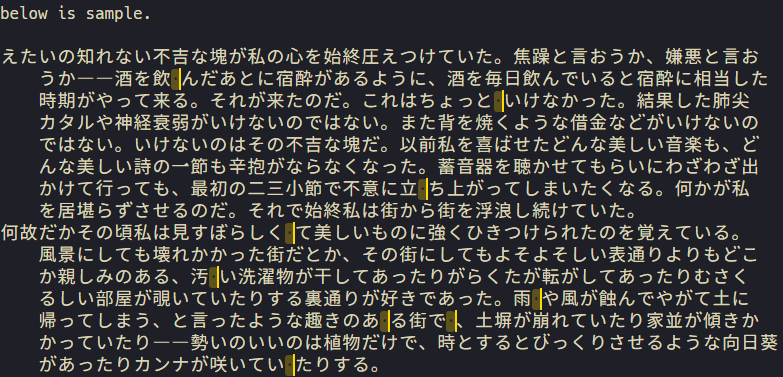

# aki README

search and select removable whitespaces.

文書中の本来不必要な空白文字（アキ）を検索・選択する。

## Features

+ `setting.json` の `aki.safeChars` で正規表現を指定する（デフォルトは ASCII 文字）。
    + この正規表現にマッチする文字に **囲まれた** アキは無視する。

### `aki.selectAll`

+ 不要なアキをすべて選択する。

### `aki.selectOnCurrentLine`

+ カーソルがある行にある、不要なアキをすべて選択する。

### `aki.splitSelection`

+ 文字列を選択した状態で実行すると、範囲内の不要なアキのみ選択する。

### `aki.openSearchPanel`

+ 検索パネルを開いて不要なアキを検索する。

**Enjoy!**
